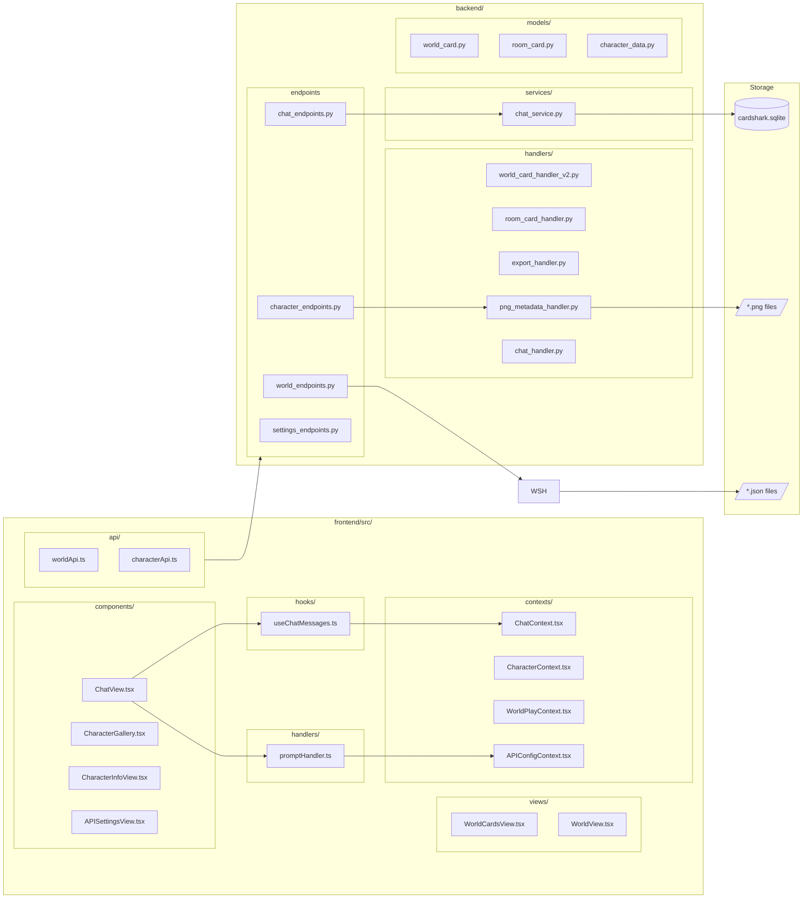
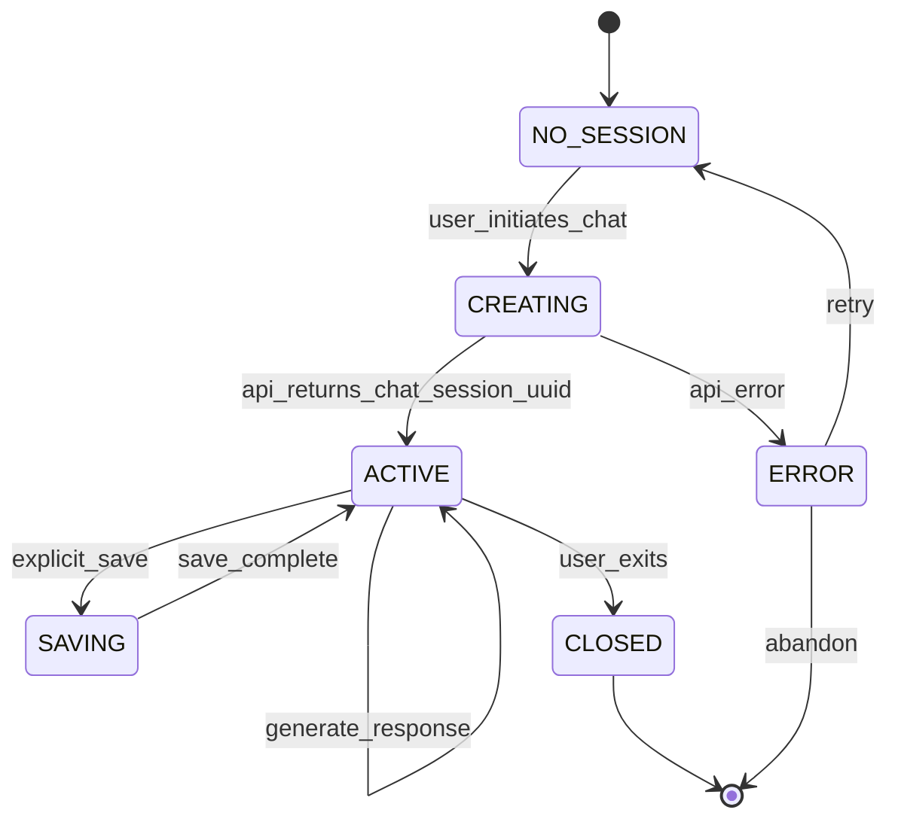
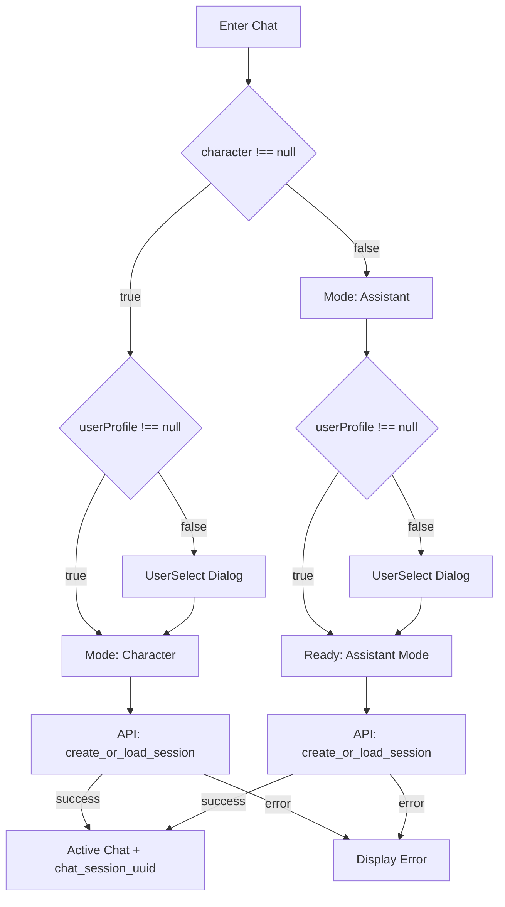
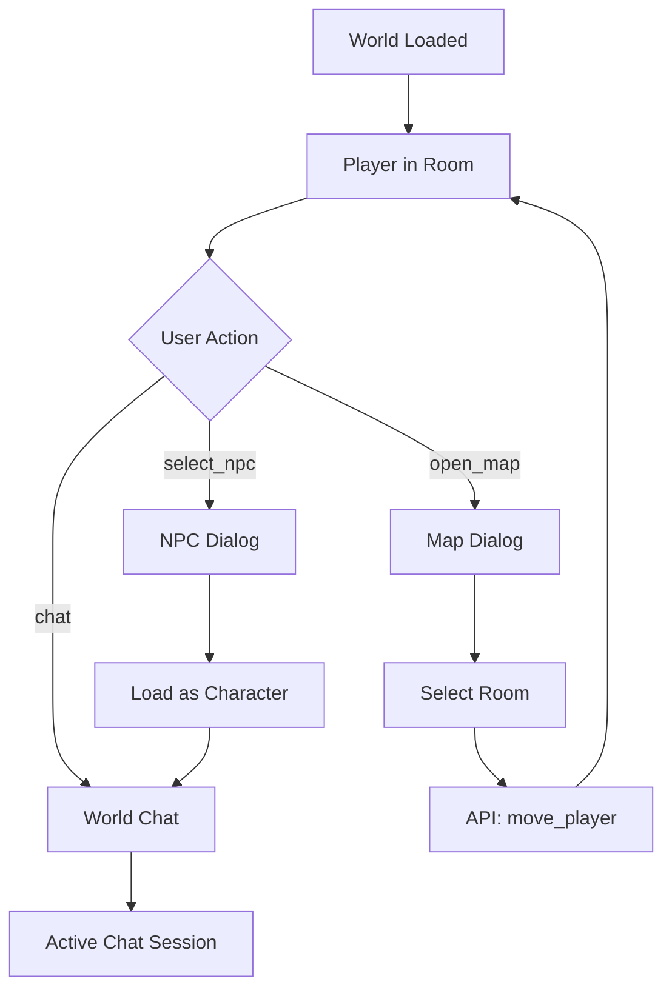

# CONTEXT.md

## SYSTEM_DEFINITION
```yaml
name: CardShark
type: web_application
architecture: client_server
purpose: PNG_metadata_editor + LLM_chat_frontend
built_by: AI_assistants (≈98%)
license: AGPL-3.0
```

## TECH_STACK
```yaml
frontend_runtime: browser
frontend_framework: React 18
frontend_language: TypeScript
frontend_build: Vite
frontend_styling: Tailwind CSS
frontend_state: React Context API
backend_runtime: Python 3.9+
backend_framework: FastAPI
backend_server: Uvicorn
persistence_chat: SQLite (cardshark.sqlite)
persistence_characters: PNG EXIF metadata (chara field)
persistence_worlds: PNG EXIF metadata (V2 PNG cards)
persistence_rooms: PNG EXIF metadata (V2 PNG cards)
persistence_settings: JSON (settings.json)
persistence_users: PNG EXIF metadata
```

## DOMAIN_TERMS
```yaml
Character:
definition: JSON metadata embedded in PNG
storage_location: EXIF field "chara"
format: v2 spec (SillyTavern compatible)
identifier: character_uuid (embedded, survives rename)
template_token: "{{char}}"

User:
definition: human player or profile representation
storage: PNG with embedded metadata
template_token: "{{user}}"
selection_ui: UserSelect component

Chat:
definition: conversation session
storage: SQLite
identifier: chat_session_uuid
constraint: ALL chat API calls require chat_session_uuid

World:
definition: navigable environment with PNG card storage
storage: characters/worlds/*.png (V2 PNG card)
structure: grid with room placements (room_uuid + grid_position)
metadata: Character Card V2 with world_data extension
directory: characters/worlds/

Room:
aliases: [Location]
definition: single World grid cell with PNG card storage
storage: characters/rooms/*.png (V2 PNG card)
contains: [introduction_text, description, NPCs (by UUID), events]
metadata: Character Card V2 with room_data extension
directory: characters/rooms/

NPC:
definition: Character assigned to Room via character_uuid
reference: room_data.npcs[].character_uuid
includes: [role, hostile flag]
equivalence: NPC references Character by UUID

Lore:
definition: keyword-triggered content injection
storage: character_book array
trigger_limit: max 1x per 3 messages

Template:
definition: LLM payload formatter
storage: templates/ directory
selection: per-API user configuration

first_mes:
definition: Character opening message

alt_greetings:
definition: alternative first_mes array
selection_ui: Message Manager
```

## FILE_GRAPH


## STATE_MACHINES

### chat_session_lifecycle


### chat_mode_resolution


### world_navigation


## API_CONTRACTS

### chat_endpoints
```yaml
create_new_chat:
method: POST
path: /api/create-new-chat
request_character_id: string|null
response_chat_session_uuid: string
response_messages: array
side_effect: creates SQLite row

load_latest_chat:
method: POST
path: /api/load-latest-chat
request_character_id: string|null
request_chat_session_uuid: string|null
response_chat_session_uuid: string
response_messages: array
response_if_none: null

append_chat_message:
method: POST
path: /api/append-chat-message
request_chat_session_uuid: string (REQUIRED)
request_message_role: user|assistant
request_message_content: string
request_message_timestamp: number
response_success: boolean
side_effect: appends to SQLite

generate_response:
method: POST
path: /api/chat/generate
request_chat_session_uuid: string (REQUIRED)
request_prompt_data: object
response_message: object
side_effect: [fetch_context, call_LLM, append_to_SQLite]

save_chat:
method: POST
path: /api/save-chat
request_chat_session_uuid: string
request_messages: array
response_success: boolean
```

### character_endpoints
```yaml
list_characters:
method: GET
path: /api/characters/
response: array

save_card:
method: POST
path: /api/characters/save-card
request: multipart (PNG + metadata)
side_effect: [embed_EXIF, preserve_character_uuid]

extract_metadata:
method: POST
path: /api/characters/extract-metadata
request: PNG file
response: v2 character data
```

### world_endpoints
```yaml
# V2 PNG-Based World Cards API
list_worlds:
method: GET
path: /api/world-cards-v2/
response: array of WorldCardSummary

create_world:
method: POST
path: /api/world-cards-v2/
request: multipart (name, description, grid_size, image)
response: WorldCardSummary

get_world:
method: GET
path: /api/world-cards-v2/{uuid}
response: WorldCard (Character Card V2 with world_data extension)

update_world:
method: PUT
path: /api/world-cards-v2/{uuid}
request: {player_position, rooms (room placements)}
response: WorldCardSummary

delete_world:
method: DELETE
path: /api/world-cards-v2/{uuid}

export_world:
method: GET
path: /api/world-cards-v2/{uuid}/export
response: .cardshark.zip archive

import_world:
method: POST
path: /api/world-cards-v2/import
request: .cardshark.zip file
response: imported world UUID

# Room Cards API
list_rooms:
method: GET
path: /api/room-cards-v2/
response: array of RoomCardSummary

create_room:
method: POST
path: /api/room-cards-v2/
request: multipart (name, description, image, npcs)
response: RoomCardSummary

get_room:
method: GET
path: /api/room-cards-v2/{uuid}
response: RoomCard (Character Card V2 with room_data extension)

update_room:
method: PUT
path: /api/room-cards-v2/{uuid}
request: {name, description, npcs}
response: RoomCardSummary

delete_room:
method: DELETE
path: /api/room-cards-v2/{uuid}
```

## INVARIANTS
```yaml
chat_session_uuid_required:
scope: all chat operations post-creation
rule: must include chat_session_uuid
violation: 400 or undefined behavior

character_uuid_immutable:
scope: character identity
rule: set once, never changed
location: PNG EXIF
survives: [rename, re-save, metadata_edit]

v2_format_compatibility:
scope: character metadata
rule: SillyTavern v2 spec compliant
violation: ecosystem incompatibility

template_required:
scope: LLM generation
rule: active template determines payload format
```

## ENTRY_POINTS
```yaml
modify_chat:
start: frontend/src/components/ChatView.tsx
check: [frontend/src/hooks/useChatMessages.ts, frontend/src/handlers/promptHandler.ts, backend/chat_endpoints.py, backend/services/chat_service.py]

modify_character:
start: backend/character_endpoints.py
check: [backend/png_metadata_handler.py, frontend/src/components/CharacterInfoView.tsx, frontend/src/components/CharacterGallery.tsx]

modify_world:
start: backend/endpoints/world_card_endpoints_v2.py
check: [backend/handlers/world_card_handler_v2.py, backend/handlers/room_card_handler.py, backend/handlers/export_handler.py, frontend/src/views/WorldPlayView.tsx, frontend/src/views/WorldEditor.tsx, frontend/src/api/worldApi.ts]

modify_api_config:
start: frontend/src/components/APISettingsView.tsx
check: [frontend/src/contexts/APIConfigContext.tsx, backend/settings_endpoints.py, templates/]

modify_prompt_format:
start: frontend/src/handlers/promptHandler.ts
check: [templates/, frontend/src/contexts/APIConfigContext.tsx]

add_endpoint:
start: backend/main.py
pattern: [1_create_endpoint, 2_create_service, 3_add_pydantic_model, 4_create_frontend_client]
```

## COMPLEXITY_WARNINGS
```yaml
ChatView_tsx:
issue: too many concerns
responsibilities: [rendering, emotion_detection, scroll, hotkeys, settings, backgrounds]
recommendation: decompose

template_system:
issue: cross-layer ripple
touches: [api_config, prompt_handler, character_context, LLM_request]
recommendation: trace full path first

png_metadata:
issue: binary + ecosystem constraints
constraint: v2 spec
risk: breaking SillyTavern compatibility
recommendation: test import/export

state_sync:
issue: frontend vs backend
source_of_truth: SQLite
frontend_role: cache
risk: stale state on silent failures
recommendation: handle errors, refresh on doubt
```

## ACTIVE_DEVELOPMENT
```yaml
# HUMAN_INPUT_REQUIRED
current_focus: null
in_progress: []
blocked_on: []
recently_completed: []
```

## HISTORY
```yaml
sqlite_migration:
date: 2025-05
change: chat persistence file->SQLite
implication: file-based chat docs outdated

v2_world_rooms_migration:
date: 2025-12
change: world/room persistence JSON->PNG (V2 cards)
implementation: "Cards All The Way Down" epic
features: [PNG-based worlds, PNG-based rooms, NPC assignments, export/import ZIP, world builder, play mode]
removed: [world_state.json, world_state_manager.py, WorldStateApi legacy methods]
implication: worlds and rooms are now portable PNG cards with embedded metadata
```

## DIRECTIVES
```yaml
before_modify:
- identify ENTRY_POINT
- check COMPLEXITY_WARNINGS
- verify INVARIANTS

when_uncertain:
- check endpoint AND handler (logic split)
- check frontend/src/contexts/ for state
- test both Character and Assistant modes

template_tokens:
- "{{char}}" and "{{user}}" resolve at prompt time
- never hardcode names

references:
- AGENT.md (tool config)
- docs/cursorrules.md (conventions)
```
