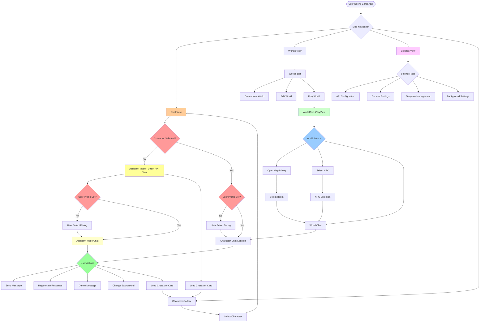
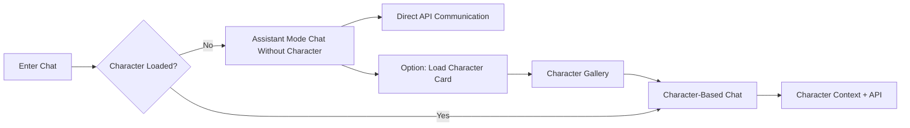
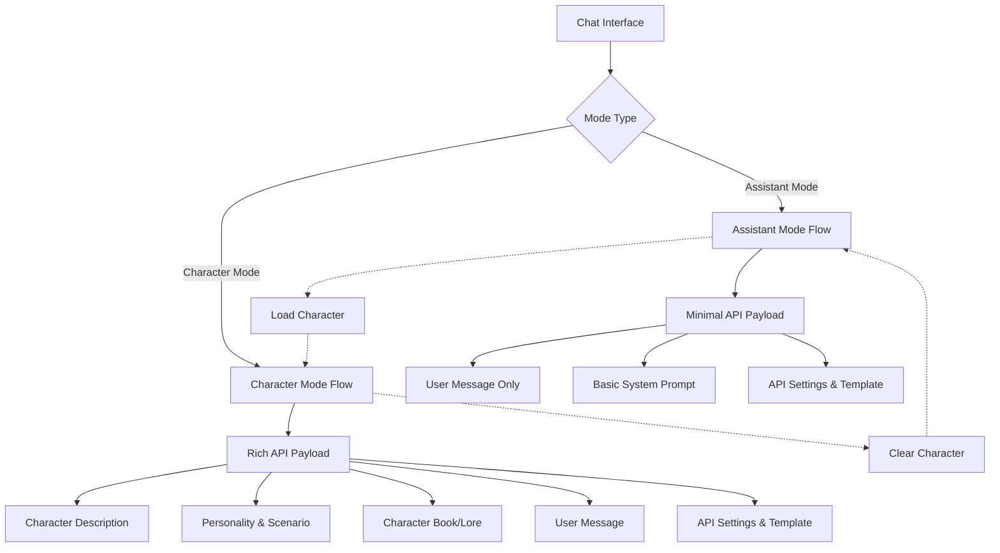
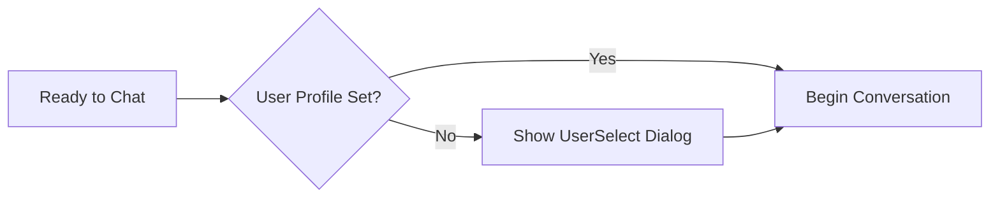
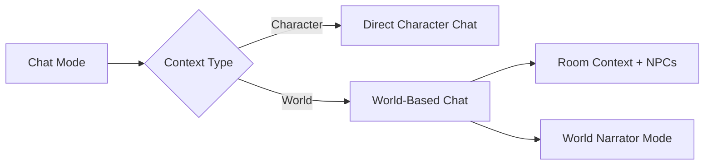
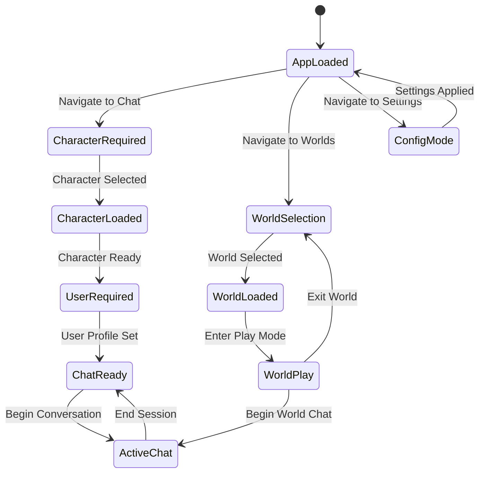

# CardShark Application Flow

## Primary Navigation & User Journey Map



## Critical User Decision Points

### 1. **Character Selection Gate** 🔑


### 2. **Assistant Mode vs Character Mode** 🤖


### 2. **Assistant Mode vs Character Mode** 🤖


### 3. **User Profile Gate** 👤


### 4. **World vs Character Chat** 🌍


## State Dependencies



## Implementation Guide: Assistant Mode Support

### **Core Requirements**
1. **No Character Validation**: Remove any blocking validation that requires a character to be loaded
2. **Minimal API Payload**: When no character is loaded, send streamlined payloads to the API
3. **Clear Mode Indication**: UI should clearly indicate when in Assistant Mode vs Character Mode
4. **Seamless Character Loading**: User can load a character at any time without losing chat context

### **API Payload Differences**

#### Assistant Mode Payload (No Character):
```json
{
  "messages": [
    {"role": "system", "content": "You are a helpful AI assistant."},
    {"role": "user", "content": "User's message"}
  ],
  "temperature": 0.7,
  "max_tokens": 500
}
```

#### Character Mode Payload (With Character):
```json
{
  "messages": [
    {"role": "system", "content": "Character description + personality + scenario"},
    {"role": "system", "content": "Character book entries (lore)"},
    {"role": "user", "content": "User's message"}
  ],
  "temperature": 0.8,
  "max_tokens": 500,
  "character_context": true
}
```

### **UI Affordances to Implement**
1. **Mode Indicator**: Show "Assistant Mode" or character name in chat header
2. **Character Load Option**: Subtle button/link to load character when in Assistant Mode
3. **Visual Distinction**: Different styling (subtle background color, icon) for Assistant Mode
4. **Transition Handling**: Smooth transition when switching between modes

### **State Management Changes**
- `characterData` can be `null` (currently required)
- Chat history should be preserved when switching modes
- API service should handle both payload types
- Template system should support basic assistant templates
