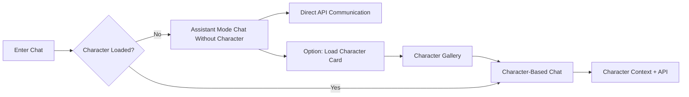
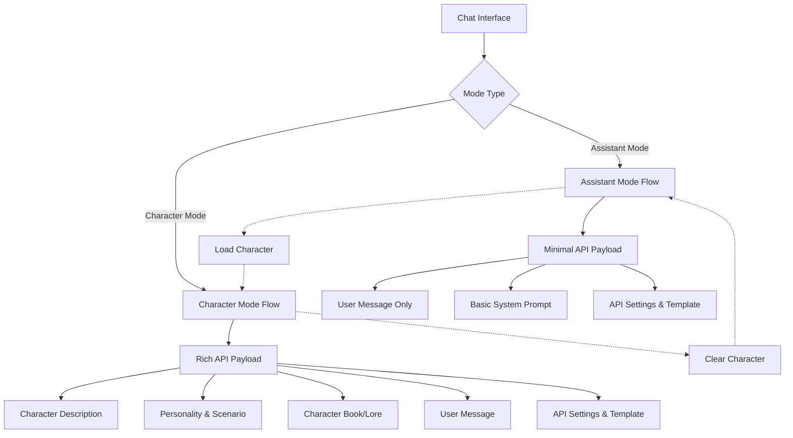
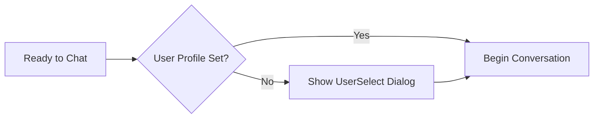
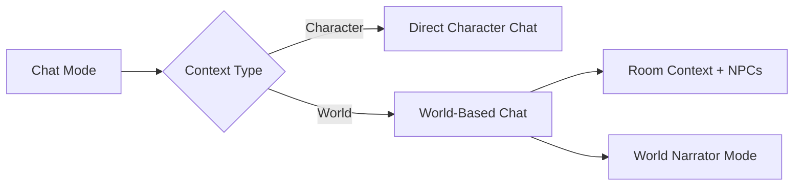
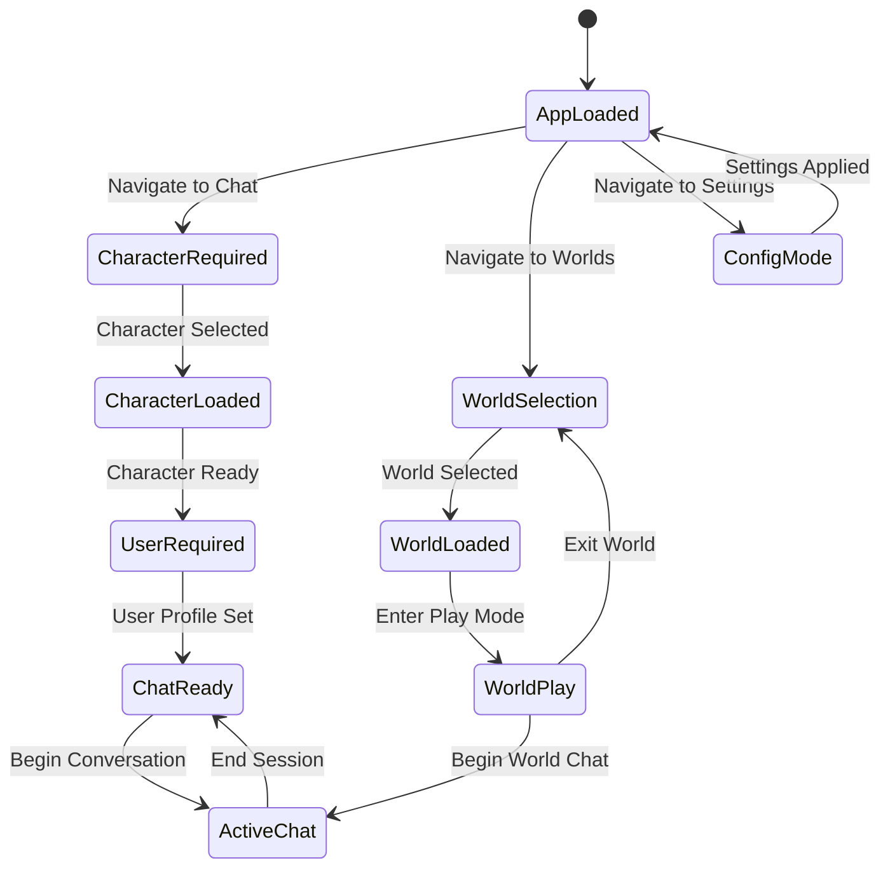

# CardShark Application Flow

## Primary Navigation & User Journey Map

**Note on Chat Persistence:** This document reflects the application flow *after* the introduction of SQLite-based chat persistence and new chat API endpoints (e.g., `/api/create-new-chat`, `/api/load-latest-chat`, `/api/append-chat-message`). Chat sessions for characters are now persistent in the database and managed via `chat_session_uuid`.

```mermaid
flowchart TD
    Start([User Opens CardShark]) --> SideNav{Side Navigation}
    
    %% Main Navigation Branches
    SideNav --> Chat[Chat View]
    SideNav --> Worlds[Worlds View] 
    SideNav --> Settings[Settings View]
    SideNav --> CharGallery[Character Gallery]
      %% Chat Flow
    Chat --> HasChar{Character Selected?}
    HasChar -->|No| AssistantMode[Assistant Mode - Direct API Chat]
    HasChar -->|Yes| HasUser{User Profile Set?}
    AssistantMode --> HasUserAssistant{User Profile Set?}
    HasUserAssistant -->|No| UserSelectAssistant[User Select Dialog]
    HasUserAssistant -->|Yes| ChatActiveAssistant[Assistant Mode Chat]
    UserSelectAssistant --> ChatActiveAssistant
    
    %% Option to load character from Assistant Mode
    AssistantMode --> LoadChar[Load Character Card]
    LoadChar --> CharGallery
    CharGallery --> SelectChar[Select Character] --> Chat
      HasUser -->|No| UserSelect[User Select Dialog]
    HasUser -->|Yes| APIGetChatSession{API: Create/Load Chat Session e.g. /api/create-new-chat}
    UserSelect --> APIGetChatSession
    APIGetChatSession --> |Success (chat_session_uuid received)| ChatActive[Character Chat Session (SQLite backed, API-driven)]
    APIGetChatSession --> |Error| HandleChatError[Error Handling / Display]
    
    ChatActive --> ChatActionsAPI{User Actions (using chat_session_uuid)}
    ChatActiveAssistant --> ChatActionsAssistant{User Actions (Assistant Mode)}

    ChatActionsAPI --> SendMsgAPI[Send Msg (/api/append-chat-message)]
    ChatActionsAPI --> RegenerateMsgAPI[Regen Msg (/api/chat/generate)]
    ChatActionsAPI --> SaveChatAPI[Save Chat (/api/save-chat)]
    ChatActionsAPI --> DeleteMsgAPI[Delete Message (API)]
    ChatActionsAPI --> LoadBg[Change Background]
    ChatActionsAPI --> LoadCharacterFromChat[Load Character Card]
    LoadCharacterFromChat --> CharGallery

    ChatActionsAssistant --> SendMsgAssistant[Send Message (Assistant)]
    ChatActionsAssistant --> RegenerateMsgAssistant[Regenerate Response (Assistant)]
    ChatActionsAssistant --> DeleteMsgAssistant[Delete Message (Assistant)]
    ChatActionsAssistant --> LoadBgAssistant[Change Background (Assistant)]
    ChatActionsAssistant --> LoadCharacterFromChatAssistant[Load Character Card]
    LoadCharacterFromChatAssistant --> CharGallery
    
    %% World Cards Flow
    Worlds --> WorldsList[Worlds List]
    WorldsList --> CreateWorld[Create New World]
    WorldsList --> EditWorld[Edit World]
    WorldsList --> PlayWorld[Play World]
    
    PlayWorld --> WorldPlay[WorldCardsPlayView]
    WorldPlay --> WorldActions{World Actions}
    WorldActions --> OpenMap[Open Map Dialog]
    WorldActions --> SelectNPC[Select NPC]
    WorldActions --> WorldChat[World Chat]
    
    OpenMap --> SelectRoom[Select Room] --> WorldChat
    SelectNPC --> NPCDialog[NPC Selection] --> WorldChat
    WorldChat --> ChatActive
    
    %% Settings Flow
    Settings --> SettingsTabs{Settings Tabs}
    SettingsTabs --> APISettings[API Configuration]
    SettingsTabs --> GeneralSettings[General Settings]
    SettingsTabs --> TemplateSettings[Template Management]
    SettingsTabs --> BackgroundSettings[Background Settings]
      %% Critical Decision Points
    style HasChar fill:#ff9999
    style HasUser fill:#ff9999
    style HasUserAssistant fill:#ff9999
    style WorldActions fill:#99ccff
    style ChatActions fill:#99ff99
    style AssistantMode fill:#ffff99
    
    %% Key Views
    style Chat fill:#ffcc99
    style WorldPlay fill:#ccffcc
    style Settings fill:#ffccff
    style ChatActiveAssistant fill:#ffffcc
```

## Critical User Decision Points

### 1. **Character Selection Gate** 🔑


### 2. **Assistant Mode vs Character Mode** 🤖


### 2. **Assistant Mode vs Character Mode** 🤖


### 3. **User Profile Gate** 👤


### 4. **World vs Character Chat** 🌍


## State Dependencies



## Implementation Guide: Assistant Mode Support

### **Core Requirements**
1. **No Character Validation**: Remove any blocking validation that requires a character to be loaded
2. **Minimal API Payload**: When no character is loaded, send streamlined payloads to the API
3. **Clear Mode Indication**: UI should clearly indicate when in Assistant Mode vs Character Mode
4. **Seamless Character Loading**: User can load a character at any time without losing chat context

### **API Interaction for Chat (with `chat_session_uuid`)**

With the introduction of SQLite-based persistence, API interactions for chat are now session-based, using a `chat_session_uuid`.

**Key API Endpoints:**

*   `POST /api/create-new-chat`:
    *   **Request:** May include `character_id`.
    *   **Response:** `{ "chat_session_uuid": "new-uuid", "messages": [] }` (or initial messages if applicable).
    *   **Action:** Creates a new chat session in the database and returns its UUID.

*   `POST /api/load-latest-chat`:
    *   **Request:** `{ "character_id": "some_char_id" }` (or potentially `chat_session_uuid` to load a specific one).
    *   **Response:** `{ "chat_session_uuid": "existing-uuid", "messages": [...] }` or `null` if no chat exists.
    *   **Action:** Loads the most recent (or specified) chat session and its messages for a character.

*   `POST /api/append-chat-message`:
    *   **Request:** `{ "chat_session_uuid": "uuid", "message": { "role": "user/assistant", "content": "...", "timestamp": ... } }`
    *   **Response:** Success/failure confirmation, potentially the updated message list or just the new message ID.
    *   **Action:** Appends a new message to the specified chat session in the database.

*   `POST /api/chat/generate`:
    *   **Request:** `{ "chat_session_uuid": "uuid", "prompt_data": { ... } }` (prompt_data might include current message, temperature, etc.)
    *   **Response:** The generated assistant message.
    *   **Action:** Fetches context from the specified chat session, generates a response, and appends both user (if applicable) and assistant messages to the session.

*   `POST /api/save-chat`:
    *   **Request:** `{ "chat_session_uuid": "uuid", "messages": [...] }` (Potentially for saving a full state if needed, though individual appends are more common).
    *   **Response:** Success/failure.
    *   **Action:** Ensures the current state of the chat session is saved. Its role might be more for explicit "save points" if not relying solely on append/generate.

**Payload Structure (Example for `/api/append-chat-message`):**
```json
{
  "chat_session_uuid": "your-active-chat-session-uuid",
  "message": {
    "role": "user",
    "content": "This is my new message.",
    "timestamp": 1678886400000
  }
}
```

**Assistant Mode vs. Character Mode with `chat_session_uuid`:**
*   **Assistant Mode:** A `chat_session_uuid` is still created (e.g., via `/api/create-new-chat` without a `character_id` or with a generic one). Payloads to `/api/append-chat-message` and `/api/chat/generate` will include this `chat_session_uuid`. The backend service ([`backend/services/chat_service.py`](backend/services/chat_service.py:0)) handles storing these messages without character-specific context.
*   **Character Mode:** A `chat_session_uuid` is created or loaded, associated with a `character_id`. All chat interactions use this UUID. The backend service links messages to this session and character. The context for generation (character description, lore) is pulled by the backend based on the `character_id` associated with the `chat_session_uuid`.

### **UI Affordances to Implement**
1. **Mode Indicator**: Show "Assistant Mode" or character name in chat header
2. **Character Load Option**: Subtle button/link to load character when in Assistant Mode
3. **Visual Distinction**: Different styling (subtle background color, icon) for Assistant Mode
4. **Transition Handling**: Smooth transition when switching between modes

### **State Management Changes (Post-SQLite Implementation)**
- **`chat_session_uuid` is Key:** The frontend is responsible for obtaining, storing (e.g., in local storage, associated with a character or as a general assistant chat UUID), and sending the `chat_session_uuid` with relevant API calls.
- **Chat History Source of Truth:** The backend database (SQLite) is now the primary source of truth for chat history. The frontend loads history via API calls (e.g., `/api/load-latest-chat`) and appends messages via API calls.
- **Local State as Cache/Working Copy:** The frontend might still hold the current chat messages in its local state for UI rendering, but this state is populated from and synchronized with the backend.
- **Switching Modes:**
    - When switching from Assistant Mode to Character Mode (by loading a character), the frontend would typically call `/api/load-latest-chat` for that character (or `/api/create-new-chat` if none exists) to get the appropriate `chat_session_uuid` and history.
    - The previous Assistant Mode `chat_session_uuid` might be stored if the user wants to switch back, or a new one created if they return to Assistant Mode later.
- **API Service (`ResilientApiService.ts`):** Must be updated to call the new chat endpoints (`/api/create-new-chat`, `/api/load-latest-chat`, `/api/append-chat-message`, `/api/chat/generate`, `/api/save-chat`) with the correct payloads, including `chat_session_uuid`.
- **Error Handling:** Robust error handling for API calls related to chat (e.g., `chat_session_uuid` not found, database errors) is crucial.
