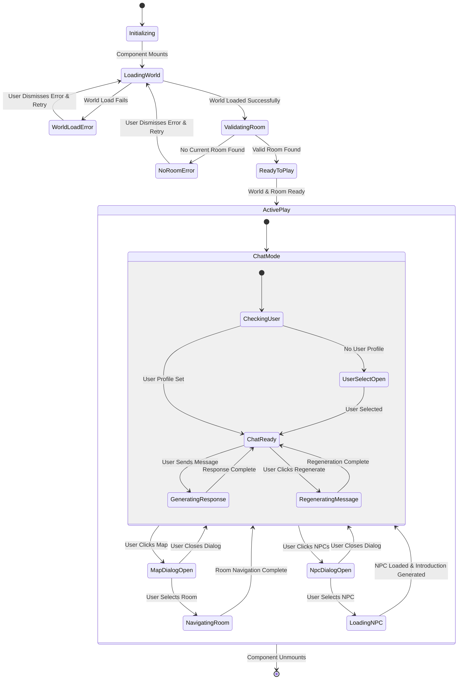
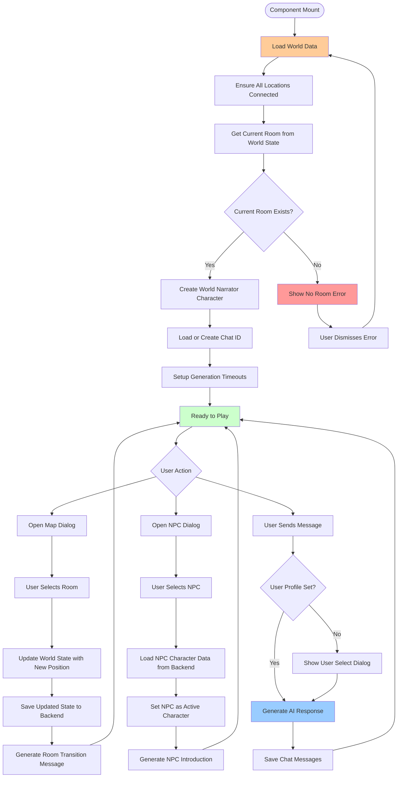
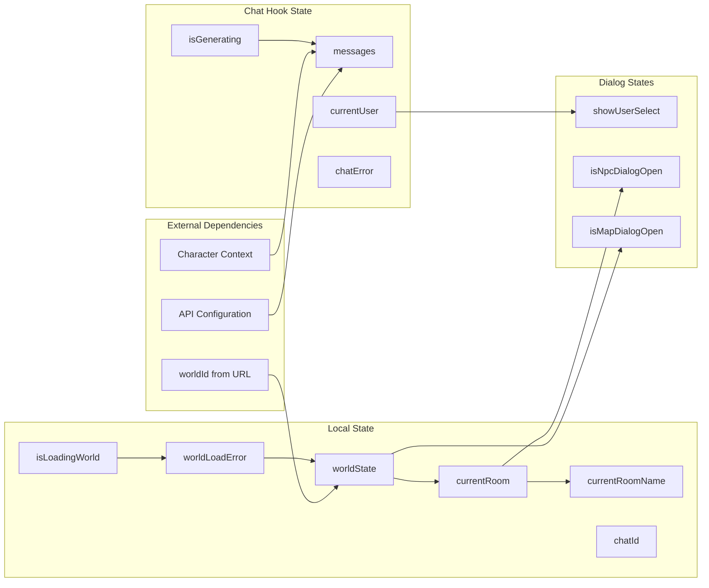
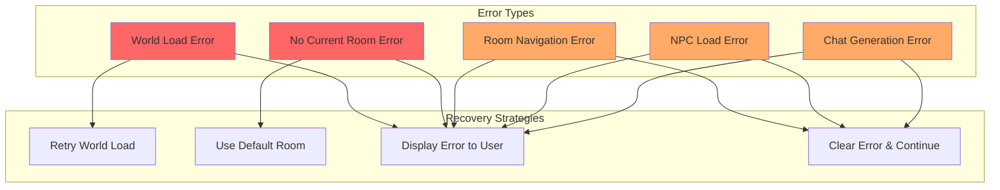
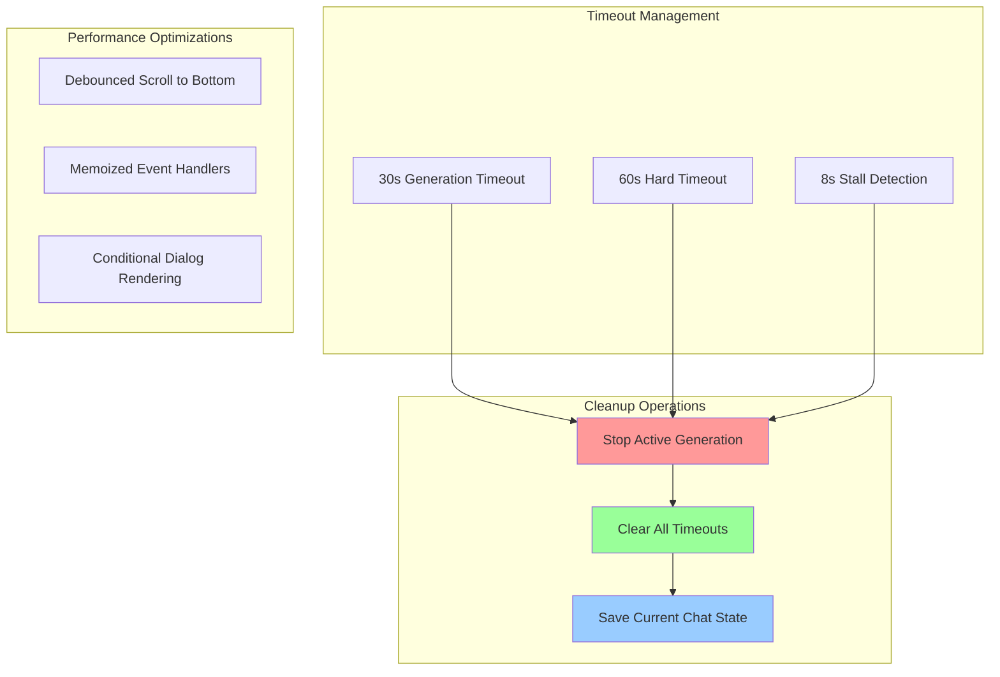

# WorldCardsPlayView State Flow

## Component State Management & User Interactions

## Critical State Transitions & Side Effects

## State Dependencies & Data Flow

## Error Handling & Recovery Patterns

## Performance & Cleanup Considerations

