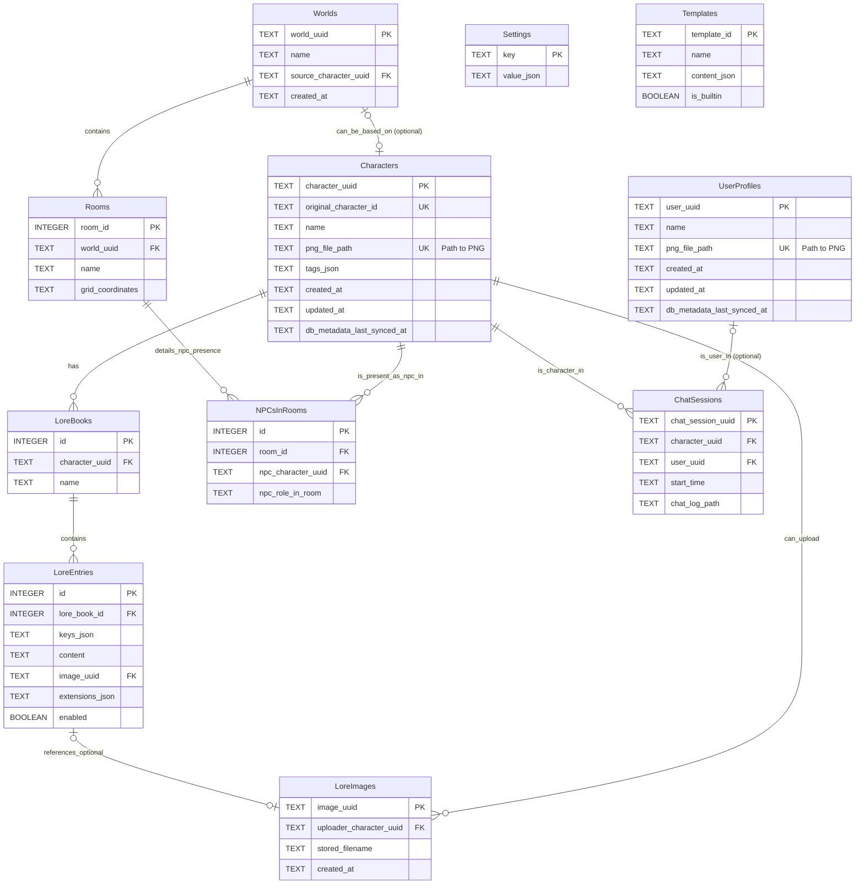

# CardShark Database Migration & Architecture Plan

**Version:** 1.0
**Date:** 2025-05-16

**1. Introduction & Goals**

CardShark's data is growing in complexity and volume. The current file-based persistence (JSON, JSONL, PNG metadata), while robustly implemented with features like atomic writes, is approaching limitations in managing complex relationships, enabling advanced queries, and scaling efficiently. The introduction of `character_inventory_manager.py` for UUID mapping highlights the increasing need for relational data management.

The primary goals of migrating to a database solution are:

*   **Improved Data Management:** Centralize and streamline the storage and retrieval of core application data.
*   **Enhanced Scalability:** Better handle a growing number of characters, worlds, lore entries, and other entities.
*   **Advanced Queryability:** Enable more complex searches, filters, and aggregations across data.
*   **Stronger Data Integrity:** Enforce relationships and constraints between data entities more effectively.
*   **Foundation for Future Growth:** Provide a solid base for new features that may be data-intensive or require complex data interactions.

**2. Current System Analysis (Recap)**

*   **Persistence:** Relies on a domain-driven, file-based system:
    *   `settings.json`
    *   Character data embedded in PNG metadata.
    *   `data/character_uuid_mapping.json` for external character UUIDs.
    *   JSONL for chat logs.
    *   `world_state.json` for world data.
*   **Strengths:** Atomic writes for data integrity, separation of concerns per domain.
*   **Limitations Addressed by Database:**
    *   Difficulty in performing complex queries across different data files (e.g., "find all characters with X tag appearing in Y world").
    *   Managing inter-file relationships (e.g., character UUIDs to lore images, NPCs to worlds) can be cumbersome and error-prone.
    *   Scalability concerns as the number of files and data volume increases.
    *   Potential performance bottlenecks with frequent read/write operations on many small files for aggregate views.

**3. Requirements & Scope for Database Implementation**

*   **Functional Requirements:**
    *   Store and manage core entities: Characters (including inventory/UUID mapping), Worlds, Lore, Chat Session metadata, Settings, Templates, User Profiles, Backgrounds.
    *   Efficiently query data (e.g., search characters by name/tags, list lore entries for a character, find NPCs in a world).
    *   Maintain data integrity through relational constraints (e.g., a lore entry must belong to an existing character).
    *   Support atomic transactions for operations that modify multiple related pieces of data.
*   **Non-Functional Requirements:**
    *   Seamless integration with the Python backend.
    *   Minimal external dependencies, suitable for a desktop application (favoring embedded databases).
    *   Good performance for common user operations.
    *   A clear and manageable migration path for existing data.
*   **Proposed Scope for Initial Phase:**
    *   **Priority 1:** Character management (migrating `character_uuid_mapping.json` and character metadata from PNGs into database tables). This directly addresses the new Character Inventory feature.
    *   **Priority 2:** Lore book and lore entry management, linked to characters.
    *   **Priority 3:** World metadata and basic room/NPC relationships.
    *   Chat messages themselves can remain in JSONL files initially, with only chat session *metadata* (participants, timestamps, log file path) stored in the database. This limits the initial data migration volume.
    *   Settings, Templates, User Profiles can be migrated subsequently or as needed.

**4. Database Option Evaluation: SQLite**

*   **Primary Recommendation: SQLite**
    *   **Serverless & Zero-Configuration:** Ideal for a desktop application like CardShark, requiring no separate database server process.
    *   **File-Based:** The entire database is stored in a single file, simplifying distribution, backup, and user data management.
    *   **Transactional:** Supports ACID properties, ensuring data integrity.
    *   **Excellent Python Support:** The `sqlite3` module is part of the Python standard library. For more advanced usage and easier schema management/migrations, an ORM like **SQLAlchemy** is highly recommended.
    *   **Mature & Reliable:** Widely used and well-tested.
    *   **Performant:** More than capable of handling the expected data load and query complexity for a local application.
*   **Alternatives Considered:**
    *   **Other Embedded DBs (e.g., DuckDB):** Powerful for analytical queries, but SQLite is generally more established for general-purpose transactional application data.
    *   **Client-Server DBs (e.g., PostgreSQL, MySQL):** Introduce significant deployment and management overhead for a local desktop application, making them less suitable.
    *   **NoSQL DBs (e.g., TinyDB, ZODB):** While offering schema flexibility, the data in CardShark (Characters, Worlds, Lore, their relationships) appears to have a sufficiently relational structure where an SQL database would provide better integrity and querying for those relationships.

**5. Proposed Database Schema Design (SQLite)**

Below is an initial schema design. This will evolve, but it provides a starting point. SQLAlchemy is recommended for ORM capabilities.

*   **Characters Table (`characters`):**
    *   `character_uuid` (TEXT, PRIMARY KEY): Canonical UUID for the character.
    *   `original_character_id` (TEXT, UNIQUE, NULLABLE): Identifier from original source if not a CardShark native character (e.g., file path hash, external ID).
    *   `name` (TEXT, NOT NULL)
    *   `description` (TEXT)
    *   `personality` (TEXT)
    *   `scenario` (TEXT)
    *   `first_mes` (TEXT)
    *   `mes_example` (TEXT)
    *   `creator_comment` (TEXT)
    *   `png_file_path` (TEXT, NOT NULL, UNIQUE): Stores the relative path to the character's PNG file.
    *   `tags` (TEXT): JSON string array.
    *   `spec_version` (TEXT)
    *   `created_at` (TEXT, ISO8601)
    *   `updated_at` (TEXT, ISO8601)
    *   `db_metadata_last_synced_at` (TEXT, ISO8601): Timestamp of when DB record was last synced with PNG.
    *   `extensions_json` (TEXT): For other `CharacterCard.data` fields.

*   **UserProfiles Table (`user_profiles`):**
    *   `user_uuid` (TEXT, PRIMARY KEY): UUID from its PNG.
    *   `name` (TEXT, NOT NULL)
    *   `description` (TEXT)
    *   `personality` (TEXT)
    *   `scenario` (TEXT)
    *   `first_mes` (TEXT)
    *   `png_file_path` (TEXT, NOT NULL, UNIQUE): Path to the user's profile PNG file.
    *   `tags_json` (TEXT)
    *   `spec_version` (TEXT)
    *   `created_at` (TEXT, ISO8601)
    *   `updated_at` (TEXT, ISO8601)
    *   `db_metadata_last_synced_at` (TEXT, ISO8601)
    *   `extensions_json` (TEXT)

*   **LoreBooks Table (`lore_books`):**
    *   `id` (INTEGER, PRIMARY KEY AUTOINCREMENT)
    *   `character_uuid` (TEXT, NOT NULL, FOREIGN KEY (`characters.character_uuid`))
    *   `name` (TEXT, DEFAULT "")

*   **LoreEntries Table (`lore_entries`):**
    *   `id` (INTEGER, PRIMARY KEY AUTOINCREMENT)
    *   `lore_book_id` (INTEGER, NOT NULL, FOREIGN KEY (`lore_books.id`))
    *   `keys_json` (TEXT): JSON array of primary keys.
    *   `secondary_keys_json` (TEXT): JSON array of secondary keys.
    *   `content` (TEXT, NOT NULL)
    *   `comment` (TEXT)
    *   `enabled` (BOOLEAN, NOT NULL, DEFAULT TRUE)
    *   `position` (TEXT)
    *   `selective` (BOOLEAN, NOT NULL, DEFAULT FALSE)
    *   `insertion_order` (INTEGER, DEFAULT 0)
    *   `image_uuid` (TEXT, NULLABLE, FOREIGN KEY (`lore_images.image_uuid`))
    *   `extensions_json` (TEXT): JSON object for `LoreEntry.extensions`.

*   **LoreImages Table (`lore_images`):**
    *   `image_uuid` (TEXT, PRIMARY KEY)
    *   `uploader_character_uuid` (TEXT, NOT NULL, FOREIGN KEY (`characters.character_uuid`))
    *   `original_filename` (TEXT)
    *   `stored_filename` (TEXT)
    *   `created_at` (TEXT, ISO8601)

*   **Worlds Table (`worlds`):**
    *   `world_uuid` (TEXT, PRIMARY KEY)
    *   `name` (TEXT, NOT NULL)
    *   `description` (TEXT)
    *   `source_character_uuid` (TEXT, NULLABLE, FOREIGN KEY (`characters.character_uuid`))
    *   `created_at` (TEXT, ISO8601)
    *   `updated_at` (TEXT, ISO8601)

*   **Rooms Table (`rooms`):**
    *   `room_id` (INTEGER, PRIMARY KEY AUTOINCREMENT)
    *   `world_uuid` (TEXT, NOT NULL, FOREIGN KEY (`worlds.world_uuid`))
    *   `name` (TEXT)
    *   `description` (TEXT)
    *   `introduction_text` (TEXT)
    *   `grid_coordinates` (TEXT)

*   **NPCsInRooms Table (`npcs_in_rooms`):**
    *   `id` (INTEGER, PRIMARY KEY AUTOINCREMENT)
    *   `room_id` (INTEGER, NOT NULL, FOREIGN KEY (`rooms.room_id`))
    *   `npc_character_uuid` (TEXT, NOT NULL, FOREIGN KEY (`characters.character_uuid`))
    *   `npc_role_in_room` (TEXT)
    *   UNIQUE (`room_id`, `npc_character_uuid`)

*   **Settings Table (`settings`):**
    *   `key` (TEXT, PRIMARY KEY)
    *   `value_json` (TEXT)

*   **Templates Table (`templates`):**
    *   `template_id` (TEXT, PRIMARY KEY)
    *   `name` (TEXT, NOT NULL)
    *   `content_json` (TEXT, NOT NULL)
    *   `is_builtin` (BOOLEAN, NOT NULL, DEFAULT FALSE)

*   **ChatSessions Table (`chat_sessions`):**
    *   `chat_session_uuid` (TEXT, PRIMARY KEY)
    *   `character_uuid` (TEXT, NOT NULL, FOREIGN KEY (`characters.character_uuid`))
    *   `user_uuid` (TEXT, NULLABLE, FOREIGN KEY (`user_profiles.user_uuid`))
    *   `start_time` (TEXT, ISO8601, NOT NULL)
    *   `last_message_time` (TEXT, ISO8601)
    *   `message_count` (INTEGER, DEFAULT 0)
    *   `chat_log_path` (TEXT, NOT NULL): Path to the JSONL file.
    *   `title` (TEXT, NULLABLE)

**Mermaid Diagram:**

**6. Data Flow, Synchronization, and PNG File Handling**

The SQLite database will **not** store the binary image data of character or user profile PNG files. The user-configured character directory (e.g., `/characters/`) containing these PNG files remains the primary, portable store for the character card data itself, ensuring compatibility with other applications.

The database will store:
1.  **Metadata Extracted from PNGs:** Key information like name, description, tags, and the embedded `character_uuid` (if present).
2.  **A Persistent File Path (`png_file_path`):** This path in the `Characters` and `UserProfiles` tables points to the actual PNG file.
3.  **CardShark-Managed UUIDs:** The `character_uuid` (or `user_uuid`) in the database serves as the canonical identifier within CardShark. For PNGs without an embedded UUID, a new UUID will be generated by CardShark and associated with the file's path in the database.

**Data Synchronization Strategy:**
*   **Loading a Character/Profile:**
    *   When CardShark needs to access character/profile data (e.g., for display in a gallery or loading into chat), it will primarily query the database.
    *   The application can use the `db_metadata_last_synced_at` timestamp in the database and compare it against the PNG file's actual modification timestamp.
    *   If the PNG file on disk is newer than `db_metadata_last_synced_at`, CardShark will re-parse the metadata from the PNG, update the corresponding record in the database, and update `db_metadata_last_synced_at`. This ensures the database reflects the latest state if the PNG was modified externally.
*   **Saving a Character/Profile:**
    *   When changes are made to a character or user profile within CardShark:
        1.  The updated metadata will be saved to the appropriate record in the SQLite database.
        2.  The same updated metadata will be written back to the `chara` field (or relevant metadata section) of the original PNG file specified by `png_file_path`. This keeps the PNG file self-contained and up-to-date.
        3.  The `updated_at` and `db_metadata_last_synced_at` timestamps in the database record will be updated.
*   **New External PNGs:**
    *   When a new PNG file is detected in the character directory (that isn't yet known to the database):
        1.  CardShark will parse its metadata.
        2.  A new `character_uuid` will be generated if one isn't embedded in the PNG.
        3.  A new record will be created in the `characters` (or `user_profiles`) table, storing the extracted metadata, the `png_file_path`, and the (newly generated or existing) `character_uuid`.

This hybrid approach ensures that the database provides efficient querying and management of metadata, while the PNG files remain the portable and compatible source of truth for the card data itself.

**7. Migration Strategy**

*   **Backup:** **Crucial first step:** Backup all existing CardShark data directories.
*   **Database Initialization:**
    *   Integrate SQLAlchemy into the backend.
    *   Define models corresponding to the tables above.
    *   Create the initial database schema (e.g., `cardshark.sqlite`) using SQLAlchemy's schema creation tools.
*   **Migration Scripts:** Develop Python scripts (leveraging SQLAlchemy models):
    1.  **Settings:** Read `settings.json` and populate `settings` table.
    2.  **Templates:** Read `/templates/` and populate `templates` table.
    3.  **User Profiles:** Read user PNGs from `/users/`, extract metadata, populate `user_profiles`, storing `png_file_path`.
    4.  **Character Inventory & Core Character Data:**
        *   Read `data/character_uuid_mapping.json`. For each entry, prepare data for the `characters` table (using mapped UUID as `character_uuid`, original ID as `original_character_id`).
        *   Iterate through character PNG files: Extract metadata, canonical `character_uuid` (if present).
        *   Merge/insert into `characters` table, ensuring `png_file_path` is stored. Prioritize embedded UUIDs if present. Generate new UUIDs for files not in mapping and without embedded UUIDs.
    5.  **Lore Data:** For each character, parse `character_book`: Create `lore_books` entry. For each lore `entry`, create `lore_entries` record.
    6.  **Lore Images:** Link/create `lore_images` entries based on `LoreEntry.image_uuid`.
    7.  **Chat Session Metadata:** Scan chat directories. Create `chat_sessions` entries with `chat_log_path`.
    8.  **Worlds, Rooms, NPCs:** Migrate `world_state.json` files to `worlds`, `rooms`, `npcs_in_rooms` tables.
*   **Phased Approach (Recommended):**
    *   **Phase 1:** Character Inventory, Character metadata, Lore.
    *   **Phase 2:** Worlds, Rooms, NPCs.
    *   **Phase 3:** Remaining domains.
*   **Data Validation:** After each phase, compare DB data against original sources.

**8. Impact on Backend & Frontend**

*   **Backend:**
    *   New database service layer (using SQLAlchemy).
    *   Refactor existing managers/handlers (e.g., `character_inventory_manager.py`, `lore_handler.py`) to use the DB service.
    *   API endpoints call refactored services. Aim for stable API contracts initially.
*   **Frontend:**
    *   Minimal initial changes if API contracts are stable.
    *   New features leveraging DB queries will require new APIs and frontend work.

**9. Benefits & Trade-offs**

*   **Benefits:** Centralized data, integrity, queryability, scalability, maintainability, foundation for future features.
*   **Trade-offs:** Initial development effort, learning curve (SQL/SQLAlchemy), added complexity, migration risk, DB file backup.

**10. Conclusion & Recommendation**

Adopting an SQLite database, managed via SQLAlchemy, is a strategic step for CardShark. It addresses data management challenges and supports future growth.

**Recommendation:** Proceed with this plan, starting with Phase 1 (Character Inventory, Character Metadata, Lore).